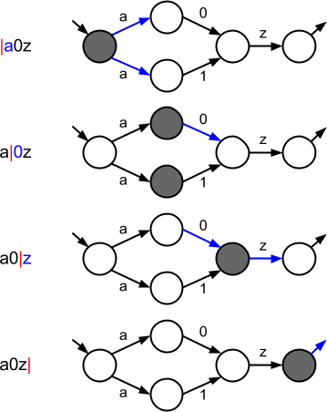
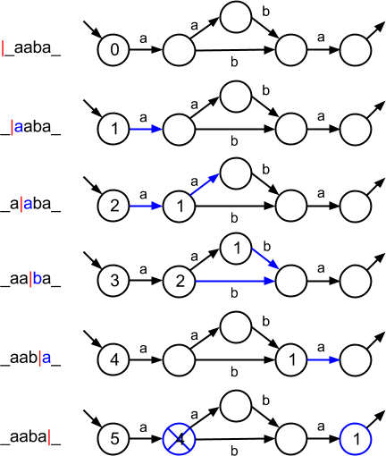

Rejit is a prototype of a non-backtracking, just-in-time, SIMD-able regular
expression compiler.
 
You can find the sources [on Github][rejit github].  It is available under the
GPLv3 licence.

We are looking for sponsors to help take this project further. We can focus
effort on new features, specific use cases or optimisations, port to other
architectures, help integrate Rejit into your projects, etc.
[Contact us][email alexandre] to discuss more.

The article below introduces the mechanisms used in Rejit and benchmark results.
 Here are a few useful links:
* [Github project page][rejit github]
* [Documentation][rejit wiki], on the Rejit wiki
* [Benchmarks results](#benchmarks) (below on this page)

### Introduction

I started working on Rejit after having read Russ Cox's excellent
[articles][Russ Cox articles].
Reading these can help understand some technical parts of the article, but is
not required.
All you should need is to see how regular expressions can be represented by
automata.

Example automaton for the regular expression `(a0|a1)z`.

Although it should behave fairly well, Rejit is still a prototype.
Development was done on my free time, so the effort went mostly into what I
thought was fun!

This article introduces a some technical information about Rejit, and then
presents benchmarks results.

  <ol>
  <li> <a href="#mechanisms">Mechanisms</a></li>
    <ol style="margin-bottom:0">
      <li style="list-style:lower-latin"> <a href="#matching_mechanism">Matching mechanism</a></li>
      <li style="list-style:lower-latin"> <a href="#looking_for_partial_matches">Looking for partial matches</a></li>
      <li style="list-style:lower-latin"> <a href="#fastforwarding_mechanism">Fast-forwarding mechanism</a></li>
      <li style="list-style:lower-latin"> <a href="#jit_code">JIT code</a></li>
    </ol>
  <li> <a href="#features">Features</a></li>
  <li> <a href="#benchmarks">Benchmarks</a></li>
    <ol style="margin-bottom:0">
      <li style="list-style:lower-latin"> <a href="#single_threaded_recursive_grep_through_the_linux_kernel_sources">Single threaded recursive grep through the Linux kernel sources</a></li>
      <li style="list-style:lower-latin"> <a href="#dna_matching_benchmark">DNA matching benchmark</a></li>
      <li style="list-style:lower-latin"> <a href="#rejit_benchmarks">Rejit benchmarks</a></li>
    </ol>
  <li> <a href="#future_work">Future work</a></li>
  </ol>

#### A few definitions

To avoid confusion later here are definitions for a few expressions used in
this article.

* **NFA**: Nondeterministic finite automaton ([Wikipedia][Wikipedia NFA]).
* **Full matching**: Testing if a regular expression matches a whole string.
   
  The regular expression `abc` full-matches the string `abc` (the match is - of
  course - `abc`).
   
  The regular expression `abc` does **not** full-match the string `0_abc_9`.
* **Partial matching**: Testing if a regular expression matches a substring of
  the text.
   
  Partial matching the regular expression `[0a]` in the string `0128abcd` yields
  two matches: `0`, and `a`.
   Partial matching can be sub-divided into 2 questions:
  <ol><ol>
    <li> Existence: is there a partial match of the regexp in the text?</li>
    <li> Location: Is there a partial match and, if so, where is it?
          
         This is harder than the 'existence' question.
         We are looking for the leftmost longest match. We must keep track of the
         boundaries of the match, and cannot exit as soon as any match is found.
    </li>
  </ol></ol>
  Note the meaning associated with 'partial matches'.
  Looking for a partial match of a regular expression in a text means searching
  for sub-strings of the text that match the full regular expression. It has
  nothing to do with matching part of the regular expression.

### Mechanisms

The following paragraphs give a short description of Rejit's two main
mechanisms.

1. The code generated for the **matching** mechanism executes a (non-backtracking)
NFA simulation to check if a regular expression matches a sequence of
characters.  Full matching only uses this mechanism.
2. The code generated for **fast-forwarding** speeds up search for partial matches by
efficiently searching for dominating sub-regexps.

#### Matching mechanism

Rejit generates code able to execute an NFA simulation for the regexp considered.

The simulation allows the automaton to be in multiple states simultaneously.  It
executes either until no nodes are set and there is no match, or until we reach
the end of the string, at which point there is a match iff an exit node is set.

See the following diagram for an illustration, and Russ Cox's
[article][Russ Cox article 1] for a more detailed explanation.
 

Automaton simulation for a full match.
 The red pipe '|' indicates the current position of the
algorithm in the string.

Full matching only use this mechanism. Execution results either in an early
exit when there is no match, or goes through scanning until the end of the
string.

#### Looking for partial matches

Assuming we have a matching mechanism (for example the one described above), how
should we search for partial matches?
 
Executing the matching mechanism successively for each character of the text
until a match is found is a trivial but very slow implementation.

Considering that an automaton is used for matching, a better solution can be to
execute the automaton simulation while setting the entry node of the automaton
at every character of the text searched. When the execution reaches an exit
node, a match is found.
 
Finding the leftmost match can easily be implemented by using the offsets `start
of match - start of string` to indicate the state of the nodes.

Below is a diagram illustrating the process to match the regular expression
`a(ab|b)a` in the text `_aaba_` with this method.

Automaton simulation with nodes indexed by string offsets.
 The red pipe '|' indicates the current position of the
algorithm in the string.

The diagram above is probably more explicit, but here are general rules to find
all leftmost longest matches using a one pass non-backtracking automaton
simulation:

<ul>
<li> A node is either empty (unset), or contains an offset from the beginning of the
string indicating where the match considered for this state started.</li>
<li> When multiple transitions can set a state, the lowest offset (leftmost match)
is preferred.</li>
When an exit node is reached:
<ul sytle="margin-bottom:0;">
  <li> A potential match is recorded (starting from the offset indicated in the
  exit node and finishing at the current string offset).</li>
  <li> It is possible that previously recorded potential matches start within the
  range of this newly recorded match; they should be unregistered.  (Consider
  for example matching `(a|aa)` in `aa`)</li>
  <li>  All nodes with a higher offset can be unset:
  they can only yield matches starting within the boundaries of the match just
  found (or the boundaries of future invalidating matches).</li>
</ul>
<li> All registered potential matches that start earlier than any node offset in
the graph are certain to be matches.</li>
</ul>

Rejit first used a similar mechanism. But even this can be painfully slow.

Consider for example the regular expression: `([complex]|(regexp)){2,7}abcdefgh(at|the|[e-nd]as well)`
 
The automaton for this regular expression is relatively complex - it has
many states and transitions.
 
The initial sub-regexps (especially the repeated bracket `[complex]`) match
easily and allow states to propagate through the nodes of the automaton.

In a situation where the regexp matches rarely (as in most use-cases), the
processing required to simulate the early nodes of the automaton is - most of the
time - lost, and translates into decreased performance.
 
Note that the issue applies to simpler (in terms of automaton complexity, not
speed) regexps like `[aeiouy]{1,10}bcdfgh`.

Notice however the sub-regexp `abcdefgh` in the middle. It most likely won't
match very often, but any match for the full regexp *must* have a substring
matching this particular sub-regexp. We can use it to significantly increase the
matching speed.

#### Fast-forwarding mechanism

The fast-forwarding mechanism uses the idea of dominating sub-regexps to
significantly speed up the code.

**Pseudo-definition**:

    ('a' is a dominating sub-regexp of 'b')
    iff
    ('b' matches the string 's' in text => 'a' matches a substring of 's')

In the regexp introduced above, `abcdefgh` and `(at|the|[e-nd]as well)` are
dominating sub-regexps.

Rejit choses what it thinks will be the easiest and fastest dominating
sub-regexp to search for, and generates efficient specialised code (using SIMD
if available). When this fast code finds a match, execution exits and continues
in the 'matching' code, which searches backward and forward for the boundaries
of a complete match.

In the benchmarks section you will find a a graph illustrating the speed-up
provided by this mechanism for this regular expression.
 
With this mechanism, the scanning speed for any regular expression can become
close to the scanning speed for the chosen dominating sub-regexp.

##### Choice of the dominating sub-regexp
The choice of the dominating sub-regexp to use for fast-forwarding is critical
for good performance.

We want a dominating sub-regexp that:

* is easy to look for, so we can generate efficient code for it.
* does not match often, so we don't have to fall back to the matching mechanism
to check for other parts of the regexp.

For example `.` is somehow easy to look for but would be a poor choice. It
matches nearly every character!
 On the other hand `abcd` is an excellent pattern. Assuming a text randomly
composed of 30 different characters, there is about one chance
in 30^4 to have a match at a particular offset, ie about 1 in 800KiB!

To chose a performant regexp, each elementary type of regular expression
(characters, brackets, anchors, etc.) is assigned a weight indicating how good
a choice it is believed to be.  After the regular expression has been
parsed, Rejit traverses the parse tree and uses those weights to identify the
fastest dominating sub-regexp it can use.

##### Backward matching

After fast-forwarding has found a potential match, the automaton simulation is
executed first backward to look for the start of a match, and then forward to
look for its end.

The code required to match backward is very similar to the code matching forward.
 Matching backward with submatches containing greed patterns (eg.
`(a*)(a*)root`) may look like an issue.
Although this is not implemented in Rejit, I believe it can easily be overcome:
 
When matching forward, the code updating the nodes of the automaton has to
prefer paths favoring the greedy patterns occurring earlier in the regexp: it
matches as many characters as possible for the earlier greedy patterns.
When matching backward this preference must be preserved, but will be translated
in matching as few characters as possible to greedy patterns occurring later in
the regexp.

#### JIT code

As a JIT compiler, Rejit generates native code tailored for each regular
expression for all the mechanisms described.

SIMD is currently only used to accelerate code paths for fast-forwarding, but
could be used in many more places.
 
When available on x86\_64 machines, Rejit uses SSE4.2 and the very convenient
string instructions that help performance and strongly facilitate
implementation, `pcmpistr[im]` (Packed Compare Implicit Length Strings, see
[Intel's developer manuals][Intel manuals]) in particular.  Earlier versions of
SSE are not supported yet.

The generated code is currently not self-modifiable. Using self-modifiable code
could allow changing the behaviour of the code at runtime depending on the text
scanned. It would certainly be a lot of fun to implement! However I am not
sure there would be many practical use-cases, and there is a lot of more
important work to do before that.

The SIMD optimised loops for the fast-forward code are probably (currently) the
most interesting and fun pieces of code generated. The code is a bit dry to
include in this article, but you can have a look at the commented code - for
example the
[code generation for alternation of standard characters strings][SIMD loop example]
(eg. `abcd|012345`).

### Features

Here are a few bullets detailing features that Rejit supports or is still
lacking. There are I believe no technical obstacles to supporting the missing
features. It just needs some more work!

* Rejit delivers high performance while being non-backtracking (like Re2).
This is its main advantage.
* It only supports x86\_64.
 Rejit should not be very hard to port to other architectures. The build
system and architecture abstraction mechanisms are similar to those used in V8.
The behaviour of the different assembly stubs is rather simple (usually
corresponding to an elementary type of regexp).
* Case insensitive search is not supported.
* Submatches and backreferences are not supported.
 This should be an interesting feature to work on. As detailed earlier I
think the design should allow for these without too much hurdle.
* It supports the ERE (extended regular expression) syntax, but lacks full
support for bracket expressions (eg. `[:digit:]`)
* It only supports ASCII characters, but not wide character types.

### Benchmarks

The results below were produced on a machine with a quad-core Intel Core
i5-2400 CPU @ 3.10GHz with 4GiB RAM on Fedora 17 (3.8.13-100.fc17.x86\_64).
It supports SSE4.2.

Results are reported for the following engines versions:

    GNU grep version 2.14, commit: 599f2b15bc152cdf19022c7803f9a5f336c25e65
    Rejit commit: b29ea4af1a3ae86dcb25bf961bc716029430c9b1
    V8 version 3.20.9, commit: 455bb9c2ab8af080aa15e0fbf4838731f45241e8
    Re2 commit: aa957b5e3374
    Python3 version 3.2.3
    Java version 1.7.0_25

The benchmarks below try to show the best performance achievable by different
engines.  
With this goal, comparing other engines to Rejit - which uses SSE4.2 - is fair.
Grep, Re2, and V8 have been recompiled on the tested system, and have the
possibility to use SIMD. In fact both V8 and Re2 use SIMD via the system
`memchr()` implementation (see Rejit benchmarked regexp 1).

#### Single threaded recursive grep through the Linux kernel sources

In both cases the grep program is run a first time without measurement to give
the OS a chance to preload the files. Without this we would be benchmarking the
time to access the files.

    $ CMD='grep -R regexp linux-3.10.6/'; $CMD > /dev/null && time $CMD > /dev/null
    real  0m0.622s
    user  0m0.356s
    sys   0m0.260s

`jrep` is a grep-like utility powered by Rejit.

    $ CMD='jrep -R regexp linux-3.10.6/'; $CMD > /dev/null && time $CMD > /dev/null
    real  0m0.370s
    user  0m0.101s
    sys   0m0.263s

The `jrep` utility performs 1.68 times faster than gnu grep in this very real
use-case!  The time spent in `sys` is equivalent, but Rejit spends 3 times less
time in `user` code.
 It is part of the sample programs in the rejit repository (see the
[wiki][rejit wiki]).  It is of course far behind grep in terms of features, but
supports searching for multi-lines patterns and has initial multithreading
support.

#### DNA matching benchmark

From the "[Computer Language Benchmarks Game][cpu_bench]", this
benchmark performs some DNA matching operations using regular expressions.

The tables below show performance (`real` running time) for different input
sizes, for

the
[fastest registered single-threaded implementation][cpu_bench single threaded fastest]
(V8), a single-threaded Rejit-powered implementation, and the fastest
single-threaded registered Python and Java 7 implementations.

    input size                 V8      Rejit     Python       Java
        50.000 (500KB)     0.034s     0.015s     0.173s     0.233s
       500.000 (  5MB)     0.217s     0.130s     1.357s     1.357s
     5.000.000 ( 50MB)     2.054s     1.246s    13.595s    12.304s
    50.000.000 (500MB)      (oom)    14.624s   140.286s      (oom)

    (oom): out of memory

the
[second fastest registered single threaded implementation][cpu_bench multi threaded fastest]
(Re2) (a quick go at running the first listed implementation would raise
failures), a multi-threaded Rejit-powered implementation, and the fastest
multi-threaded registered Python and Java 7 implementations.

    input size                Re2      Rejit     Python       Java
        50.000 (500KB)     0.022s     0.011s     0.167s     0.196s
       500.000 (  5MB)     0.183s     0.087s     0.897s     0.669s
     5.000.000 ( 50MB)     1.629s     0.971s     8.882s     5.166s
    50.000.000 (500MB)    20.693s    11.594s   (killed)      (oom)

    (oom): out of memory
    (killed): program stopped before finishing.

See performance for various engines and languages for
[single-thread][cpu_bench single threaded] and
[multi-threaded][cpu_bench multi threaded] implementations.
The rejit programs used to run these benchmarks are also part of the rejit
sample programs (see the rejit [wiki][rejit wiki]).

#### Rejit benchmarks

These are benchmarks from the Rejit repository.
Engines are benchmarked to find all (leftmost longest) matches of a regular
expression in a randomly generated text (with characters in the range `[0-z]`
if nothing else is specified).
 Performance is reported in bytes per second (size of the text matched
divided by the time to process it). This can be seen as the speed at which
files of a given size can be processed. It is easier to report and appreciate
than a delay close to zero.

Benchmark 4 illustrates the fast-forward mechanism, but other benchmarks show
Rejit performing well for more common patterns.

 
* '*best* ' performance graphs don't take compilation time into account.
* '*worst* ' performance graphs show performance for 1 run and 1 compilation.
* '*amortised* ' performance graphs show performance for 1 compilation and 100 runs.
  (Due to Javascript `Date` precision in milliseconds, V8 text sizes under
  128KiB use 20.000 runs instead.)

<table>
  <tr>
    <td>
      

        <strong>Regexp 1:</strong> <code>abcdefg</code>
        

        Search for a simple concatenation of characters.
        The text is randomly generated from charactres in the range <code>[b-z]</code>, so the
        starting character <code>a</code> is <strong>not</strong> present in the text searched.
        

        

        V8 and Re2 use <code>memchr()</code> to look for the starting character.
        The absence of the starting character in the text matched allows to stay in
        the <code>memchr()</code> SIMD optimised loop, yielding excellent performances.
        

        

        Rejit generates a custom SSE4.2 loop, which does not look only for the initial <code>a</code>,
        but instead for the whole <code>abcdefg</code> pattern. It does not perform as fast in this
        rather uncommon use-case.
        

      

    </td>
  </tr>
  <tr>
    <td style="padding-bottom:50px;">
      

        
 

        
 <ul id="plot_parallel_0_chars_null_density_choices" style="list-style: none;" class="flot_choices"> </ul> 

      

      
    </td>
  </tr>
  <tr>
    <td>
      

        <strong>Regexp 2:</strong> <code>abcdefg</code>
        

          Same as before, except that the text to match is composed of random (equally
          probable) characters in the range [0-z].
          Performance deceases with the higher density of potential
          matches as engines are forced to exit their optimised loop more often.
        

      

    </td>
  </tr>
  <tr>
    <td style="padding-bottom:50px;">
      

        
 

        
 <ul id="plot_parallel_1_chars_average_density_choices" style="list-style: none;" class="flot_choices"> </ul> 

      

      
    </td>
  </tr>
  <tr>
    <td>
      

        <strong>Regexp 3:</strong> <code>abcdefg</code>
        

        Same as before, but this time the character range is [a-j].
        Performance decreases further.
        

      

    </td>
  </tr>
  <tr>
    <td style="padding-bottom:50px;">
      

        
 

        
 <ul id="plot_parallel_2_chars_high_density_choices" style="list-style: none;" class="flot_choices"> </ul> 

      

      
    </td>
  </tr>
  <tr>
    <td>
      

        <strong>Regexp 4:</strong> <code>([complex]|(regexp)){2,7}abcdefgh(at|the|[e-nd]as well)</code>
        

        This illustrate the "fast forward" mechanism used in Rejit.
         
        Rejit choses to scan the text for <code>abcdefgh</code> and, when a match
        is found, scans backward and forward for the limits of the regular expression.
         The performance profile for Rejit looks clearly like for regexp 2 above.
        

      

    </td>
  </tr>
  <tr>
    <td style="padding-bottom:50px;">
      

        
 

        
 <ul id="plot_parallel_3_complex_simple_ff_choices" style="list-style: none;" class="flot_choices"> </ul> 

      

      
    </td>
  </tr>
  <tr>
    <td>
      

        <strong>Regexp 5:</strong> <code>(abcd---|efgh___)</code>
        

        Search for an alternation of two words with no substring in common.
        

        

        Rejit has no choice but to look for both strings. The performance is about
        half the performance to search for single string.
         It is slightly under that because the different prefixes for the
        two strings introduce more chances to exit from the <code>pcmpistri</code>
        based code loop. Compare with the following benchmark.
        

      

    </td>
  </tr>
  <tr>
    <td style="padding-bottom:50px;">
      

        
 

        
 <ul id="plot_parallel_4_alternation_2_np_choices" style="list-style: none;" class="flot_choices"> </ul> 

      

      
    </td>
  </tr>
  <tr>
    <td>
      

        <strong>Regexp 6:</strong> <code>(abcd---|abcd___)</code>
        

        Search for an alternation of two words sharing a common prefix.
         
        Re2 spots the common prefix and uses the information to speed up the search,
        probably by interpreting it as <code>abcd(---|___)</code>.
        Rejit and (apparently) V8 do not do that yet. With it performance would
        jump back to something like for regexp 2.
        

      

    </td>
  </tr>
  <tr>
    <td style="padding-bottom:50px;">
      

        
 

        
 <ul id="plot_parallel_5_alternation_2_p_choices" style="list-style: none;" class="flot_choices"> </ul> 

      

      
    </td>
  </tr>
</table>

### Future work

Performance already looks good, and the fast-forward mechanism enables stable
high performance for a wide range of regular expressions, but no real work has
yet gone into fine optimisation.
The handling of many 'tricky' regular expressions could be improved to yield
much faster code. But even simple word searches like in benchmarks 1, 2, and 3
may benefit from a rewrite: `pcmp_str_` instructions are convenient, but well
designed code using AVX `pcmp` may turn out to be faster.

Before any further performance work, important features like
case-insensitive search, submatches, backward-references, handling of other
character types, etc.  may be required to make rejit more attractive for general
purposes.

For questions, feedback, suggestions, to talk about regular expression matching,
optimisation, or other related topics, please use the [rejit-users group][rejit_users]
or [email me][email alexandre].

  [rejit github]: https://github.com/coreperf/rejit
  [rejit wiki]: https://github.com/coreperf/rejit/wiki
  [Russ Cox articles]: http://swtch.com/~rsc/regexp/
  [Russ Cox article 1]: http://swtch.com/~rsc/regexp/regexp1.html
  [Wikipedia NFA]: http://en.wikipedia.org/wiki/Nondeterministic_finite_automaton
  [Intel manuals]: http://www.intel.com/content/www/us/en/processors/architectures-software-developer-manuals.html
  [SIMD loop example]: https://github.com/arames/rejit/blob/master/src/x64/codegen-x64.cc#L1064
  [cpu_bench]: http://benchmarksgame.alioth.debian.org/
  [cpu_bench single threaded fastest]: http://benchmarksgame.alioth.debian.org/u64/program.php?test=regexdna&lang=v8&id=2
  [cpu_bench single threaded]: http://benchmarksgame.alioth.debian.org/u64/benchmark.php?test=regexdna&lang=all&data=u64
  [cpu_bench multi threaded fastest]: http://benchmarksgame.alioth.debian.org/u32q/program.php?test=regexdna&lang=gpp&id=2
  [cpu_bench multi threaded]: http://benchmarksgame.alioth.debian.org/u64q/benchmark.php?test=regexdna&lang=all&data=u64q
  [rejit_users]: https://groups.google.com/forum/#!forum/rejit-users
  [email alexandre]: mailto:alexandre@coreperf.com
